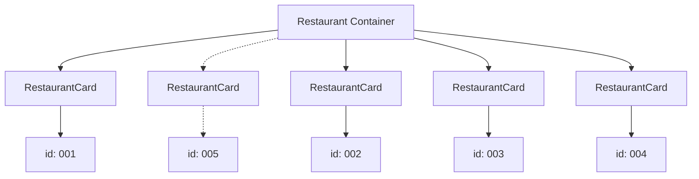

# Props And Key

## Props

Props are data passed from a parent component to a child component.

Parent:

```jsx
<RestaurantCard resturantData={restaurant} />
```

Child:

```jsx
const RestaurantCard = (props) => {
  const { resturantData } = props;
};
```

## Passing Hardcoded Props

Before using real restaurant data, we can pass values manually.

Parent:

```jsx
<RestaurantCard
  resturanatName="Barbeque Nation"
  restaurantRating="3.7"
  returantCuisines="North Indian, South Indian, Chinese"
  restaurantAddress="ABIDS"
/>
```

Child:

```jsx
const RestaurantCard = (props) => {
  const {
    resturanatName,
    restaurantRating,
    returantCuisines,
    restaurantAddress,
  } = props;
};
```

This works, but it is not very scalable. If we have many restaurants, passing a full restaurant object is better.

Props flow:

```text
Parent -> Child
```

In this app:

```text
Body -> RestaurantCard
```

## Why Props Are Needed

Props make components reusable.

The same `RestaurantCard` component can show different restaurants because each card receives different data.

## Destructuring Props

Instead of repeatedly writing long paths:

```jsx
resturantData.info.name;
resturantData.info.avgRating;
```

We can destructure:

```jsx
const { name, avgRating, cuisines, locality, areaName, costForTwo } =
  resturantData.info;
```

Then use:

```jsx
<h3>{name}</h3>
<h4>{avgRating} stars</h4>
<h4>{cuisines.join(", ")}</h4>
```

## Optional Chaining And Fallback

Sometimes data may not be available immediately. To avoid undefined errors, we can use optional chaining and fallback.

```jsx
const { name, avgRating, cuisines, locality, areaName, costForTwo } =
  resturantData?.info || {};
```

Meaning:

- `resturantData?.info` means access `info` only if `resturantData` exists.
- `|| {}` means if `info` is missing, use an empty object as fallback.
- This helps avoid errors while destructuring.

Important:

Even with this fallback, if `cuisines` is undefined, this can still fail:

```jsx
<h4>{cuisines.join(", ")}</h4>
```

So we should make sure `cuisines` exists before using `.join()`.

In this flowchart, `Restaurant Container` is rendering many `RestaurantCard` components.



## Why We Use `key` In React
Key is the only thing which we can take as a reference and got to know:-
- Which card is new?
- Which card changed?
- Which card was removed?
- Which card stayed same? 


Each `RestaurantCard` looks same as a component, but the data is different:

- `B` has `id: 001`
- `X` has `id: 005` --> new Card
- `C` has `id: 002`
- `D` has `id: 003`
- `E` has `id: 004`

Without key, React only sees many same RestaurantCard components and may get confused/ Hallucinate while updating the list.

`Important`: key is not passed as props to RestaurantCard. It is only used by React internally.

Example:

```jsx
restaurantList.map((restaurant) => (
  <RestaurantCard
    key={restaurant.info.id}
    resturantData={restaurant}
  />
))
```


## Key In React

When rendering a list, React needs a unique identity for every item. That identity is given using `key`.

```jsx
restaurantList.map((restaurant) => (
  <RestaurantCard key={restaurant.info.id} resturantData={restaurant} />
));
```

React uses `key` to understand:

- Which item is new.
- Which item changed.
- Which item was removed.
- Which item stayed the same.

## Important Point About Key

`key` is used internally by React.

It is not passed as props to the child component.

This will not work:

```jsx
props.key;
```

If the id is needed inside the child component, pass it separately:

```jsx
<RestaurantCard
  key={restaurant.info.id}
  resId={restaurant.info.id}
  resturantData={restaurant}
/>
```

## Avoid Index As Key

Avoid this when list items can be added, removed, or reordered:

```jsx
restaurantList.map((restaurant, index) => (
  <RestaurantCard key={index} resturantData={restaurant} />
));
```

Why:

- Index changes when list order changes.
- React may update the wrong component.
- It can cause UI bugs.

Best practice:

```jsx
key={restaurant.info.id}
```

## Interview Points

- Props are used to pass data from parent to child.
- Props are read-only.
- `key` helps React identify list items uniquely.
- `key` is not available inside child props.
- Unique id is better than index as key.

